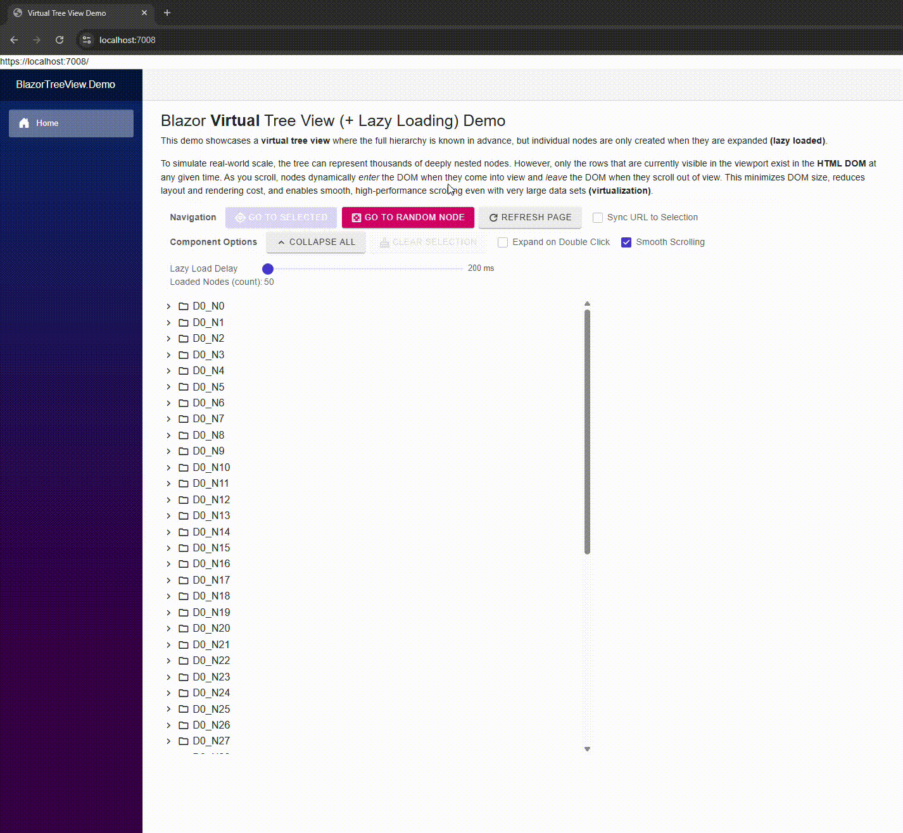

# Blazor Virtual Tree View

A high-performance, virtualized tree view component for Blazor with lazy-loading support. This repository contains the reusable `VirtualTreeView` component and a demo app showing how to use it at scale. As the Blazor ecosystem continues to mature, this project helps address a gap in available open-source components.

Solution: `BlazorVirtualTreeView.slnx`

## Key features

- Virtualization: only visible rows exist in the DOM for smooth scrolling.
- Lazy loading: children are requested on expansion using a `LoadChildren` callback.
- Programmatic navigation: methods such as `SelectNodeAsync` to navigate to a path.
- Selection sync: optional URL query synchronization for the selected node.
- Context menus: example integration using `ContextMenuService`.
- Small footprint and responsive UI: smooth scrolling and size options (`VirtualTreeViewSize`).
- Demo telemetry: demo shows a running `TotalLoadedNodeCount` to observe lazy-loading behavior.

See the demo app in `examples/BlazorTreeView.Demo` for a working example.

> Demo UI note: the demo app included here was built using Radzen demo components (buttons, sliders, menus) for convenience - any Blazor component library should work with this component.

## Data model flexibility

Although the demo shows a folder / subfolder style tree, the component is data-agnostic and supports any hierarchical model that can be expressed with a stable `Path` per node and a `CanHaveChildren` flag. Examples beyond filesystem-style folders:

- Case management: `cases/2025/12345/documents`
- Organizational charts: `company/division/team/member`
- Product categories and SKUs: `electronics/phones/brand/model`
- Dependency graphs (flattened into a navigable path)
- Time-based buckets: `2025/Q1/Week12/Events`

How to adapt your data:

- Each `VirtualTreeViewNode<T>` carries a `Path` string and user `Value` (your domain object). The component uses the path segments to navigate and expand programmatically (see `SelectNodeAsync`).
- `LoadChildren` can create nodes however you like - map your domain objects into `VirtualTreeViewNode<T>` with any naming or path scheme.
- The tree does not require strictly two-level folder / file semantics: nodes can represent categories, items, groups, or any concept where `CanHaveChildren` indicates the presence of loadable children.

This flexibility means you can present hierarchical data that is not a literal filesystem but still benefits from virtualization and lazy-loading.

## Icon customization

The component provides simple, built-in icon controls and is easy to customize:

- Component-level parameters:
  - `NodeIconCollapsed` - icon name used for nodes that can have children but are currently collapsed (default: "folder").
  - `NodeIconExpanded` - icon name used for nodes that have children (default: "folder_open").
  - `DefaultIcon` - icon name used for leaf nodes (default: "Description").

These parameters are used by the component's internal icon resolver (`ResolveNodeIcon` and `ResolveExpandIcon`) to choose which icon string to render for each row. Example usage in markup:

`<VirtualTreeView NodeIconCollapsed="folder" NodeIconExpanded="folder_open" DefaultIcon="description" />`

Note: Per-node icon customization is not supported out of the box yet.
If you need per-node icons today, you can extend the node model and customize the rendering logic. Currently exploring first-class per-node icon support in a future release, since nodes can represent arbitrary domain data. Things may change here a lot in regard to icon overriding and handling. 

Styling

- The demo uses Google Material Symbols via `material-symbols-outlined` CSS class for icons. You can change the class or render arbitrary markup in the template to use Font Awesome, SVGs, or image icons.
*For your own project be sure to include - `<link href="https://fonts.googleapis.com/css2?family=Material+Symbols+Outlined"rel="stylesheet" />` - in the App.razor header

## Core component files

- `src/BlazorVirtualTreeView/VirtualTreeView.razor`
- `src/BlazorVirtualTreeView/VirtualTreeView.razor.cs`
- `src/BlazorVirtualTreeView/VirtualTreeViewNode.cs`

Demo app:
- `examples/BlazorTreeView.Demo/Components/Pages/Home.razor`

## Demo GIF

Description: The GIF shows expanding a deep node, node navigation via URL query string, real-time lazy loading, and virtual scrolling with smooth scrolling enabled.  

## Quick start (run the demo)

Requirements:
- Targets .NET 10. 

From your IDE open the solution file:

`BlazorVirtualTreeView.slnx`

Then build and run the `BlazorTreeView.Demo` project from the IDE.

## How to use the component

- Provide root nodes via `Roots`.
- Supply a child-loading callback via `LoadChildren="LoadChildrenAsync"`.
- Use component API methods on the `@ref`-ed `VirtualTreeView<T>` instance:
  - `SelectNodeAsync(path)`
  - `AddNode(...)`
  - `RemoveNode()`
  - `RefreshSelectedAsync()`

See `examples/BlazorTreeView.Demo/Components/Pages/Home.razor` for a full usage example.

Note: For your own project you can just copy the class library to your solution directory and include it as a dependency for your given Blazor project. I do hope to get a Nuget package out eventually to make things even easier.

## Project Background

This project began out of necessity.

For my day job, I needed a virtualized TreeView for .NET Blazor that could handle very large data sets in a Blazor Server application. While popular UI frameworks like MudBlazor and Radzen offer feature rich TreeView components, none provided true tree view render virtualization - at least as of the time of this writing.

With limited time to study their project structures and source code in order to design such a feature, I decided to build a prototype myself, believing it would be faster. Within a day, I had a promising rough prototype, and after a a number of days of testing and refinement, it was released to a production environment.

Afterward, I wanted to take the concept further and give something back to the open-source community. I set out to turn the prototype into a clean, reusable component that others could adapt or extend in their own Blazor applications. After many hours of iteration and refinement, the project was published to GitHub-just in time for Christmas 2025. Hopefully a nice Christmas gift to someone! 

The original VirtualTreeView prototype used MudBlazor; however, for this project, even though the demo is built with Radzen, the core VirtualTreeView was intentionally designed to be library-agnostic and should work with virtually any Blazor UI framework. More refinement to come. 

## Contributing

- Contributions are most welcome. 😊 Send over your PRs or open a GitHub issue if you're too busy for that!

## License

This project is licensed under the MIT License - see the `LICENSE` file for details.

---

MIT License

Copyright (c) 2025 YOUR_NAME

Permission is hereby granted, free of charge, to any person obtaining a copy
of this software and associated documentation files (the "Software"), to deal
in the Software without restriction, including without limitation the rights
to use, copy, modify, merge, publish, distribute, sublicense, and/or sell
copies of the Software, and to permit persons to whom the Software is
furnished to do so, subject to the following conditions:

The above copyright notice and this permission notice shall be included in all
copies or substantial portions of the Software.

THE SOFTWARE IS PROVIDED "AS IS", WITHOUT WARRANTY OF ANY KIND, EXPRESS OR
IMPLIED, INCLUDING BUT NOT LIMITED TO THE WARRANTIES OF MERCHANTABILITY,
FITNESS FOR A PARTICULAR PURPOSE AND NONINFRINGEMENT. IN NO EVENT SHALL THE
AUTHORS OR COPYRIGHT HOLDERS BE LIABLE FOR ANY CLAIM, DAMAGES OR OTHER
LIABILITY, WHETHER IN AN ACTION OF CONTRACT, TORT OR OTHERWISE, ARISING FROM,
OUT OF OR IN CONNECTION WITH THE SOFTWARE OR THE USE OR OTHER DEALINGS IN THE
SOFTWARE.
